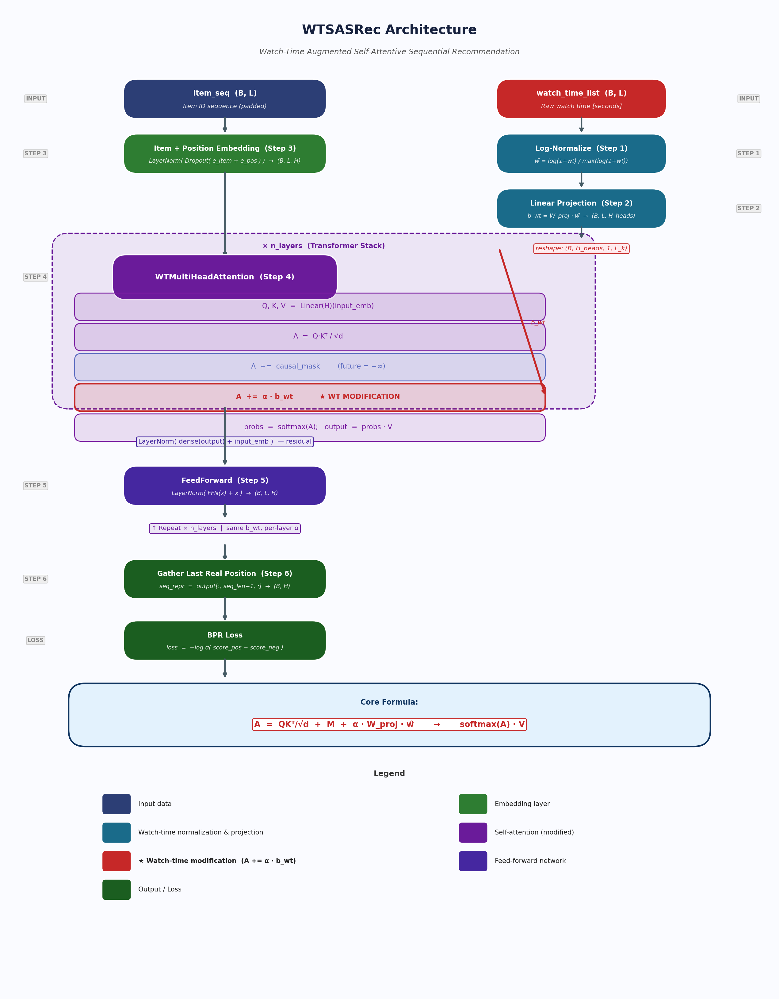

# WTSASRec — Architecture & Implementation Analysis

> **Thesis contribution:** *"Introduce watch time as a weighting or gating mechanism into a baseline model — items watched longer get higher influence on the next prediction."*
>
> **Core mechanism:** **Sửa đổi Attention Score** (Attention Score Modification)

---

## 1. Tổng quan cơ chế (Overview)

WTSASRec mở rộng SASRec bằng cách **thêm một bias phụ thuộc vào watch time vào attention score trước khi tính softmax**. Điều này khiến mỗi query tự nhiên chú ý nhiều hơn đến các item mà người dùng đã xem lâu hơn trong lịch sử.

**Standard SASRec:**

$$A = \frac{QK^T}{\sqrt{d}} + \mathbf{M}, \qquad \text{output} = \text{softmax}(A) \cdot V$$

**WTSASRec** thêm một số hạng watch-time bias:

$$A = \frac{QK^T}{\sqrt{d}} + \mathbf{M} + \alpha \cdot \mathbf{b}_{wt}$$

$$\text{output} = \text{softmax}(A) \cdot V$$

trong đó $\alpha$ là **learnable scalar parameter** (khởi tạo = 1.0), cho phép model tự học mức độ ảnh hưởng của watch time. $\mathbf{M}$ là causal mask (upper-triangular $-\infty$). $\mathbf{b}_{wt}$ là watch-time bias vector.

---

## 2. Watch-Time Normalization

Raw watch time (giây) được chuẩn hoá theo từng sequence:

**Bước 1 — Log transform** (giảm ảnh hưởng outlier):

$$\ell_i = \log(1 + wt_i), \qquad i = 1, \ldots, L$$

**Bước 2 — Per-sequence max normalization** (đưa về $[0, 1]$):

$$\tilde{w}_i = \frac{\ell_i}{\max_j(\ell_j) + \varepsilon}$$

trong đó $\varepsilon = 10^{-8}$ tránh chia cho 0. Kết quả: $\tilde{w}_i \in [0, 1]$.

---

## 3. Watch-Time Bias Projection

Scalar normalized watch time được chiếu thành bias riêng cho từng attention head:

$$\mathbf{b}_{wt} = W_{\text{proj}} \cdot \tilde{\mathbf{w}} \in \mathbb{R}^{B \times L \times H_{\text{heads}}}$$

trong đó $W_{\text{proj}} \in \mathbb{R}^{H_{\text{heads}} \times 1}$ là linear projection learnable — mỗi attention head học một hệ số riêng cho watch-time signal.

**Reshape để broadcast lên attention matrix:**

$$\mathbf{b}_{wt}^{T} \in \mathbb{R}^{B \times H_{\text{heads}} \times 1 \times L_k}$$

Shape $(B, H, 1, L_k)$ sẽ **tự động broadcast** lên $(B, H, L_q, L_k)$ — nghĩa là mọi query đều nhận cùng watch-time bias cho mỗi key.

---

## 4. Luồng dữ liệu đầy đủ (Full Data Flow)

```
Input:
  item_seq        : (B, L)   — item ID sequence (padded)
  watch_time_list : (B, L)   — raw watch time in seconds

STEP 1 — Normalize watch time                      [WTSASRec]
  wt_norm = log(1+wt) / (max(log(1+wt)) + eps)    → (B,L) in [0,1]

STEP 2 — Project to per-head bias                  [WTSASRec]
  wt_bias = Linear(1 → H_heads)(wt_norm)           → (B, L, H_heads)

STEP 3 — Item + Position Embedding                 [WTSASRec.forward]
  item_emb   = ItemEmbedding(item_seq)             → (B, L, H)
  pos_emb    = PositionEmbedding(0..L-1)           → (B, L, H)
  input_emb  = LayerNorm(Dropout(item+pos))        → (B, L, H)

STEP 4 — Watch-Time Augmented Attention            [WTMultiHeadAttention]
  Q = W_Q * input_emb     → (B, H_heads, L, d)    d = H/H_heads
  K = W_K * input_emb     → (B, H_heads, d, L)    [transposed]
  V = W_V * input_emb     → (B, H_heads, L, d)

  A  = Q*K / sqrt(d)      → (B, H_heads, L, L)    raw scores
  A += causal_mask         → broadcast (B,1,1,L)   future=-inf
  A += alpha * wt_bias_t   → broadcast (B,H,1,L)  *** WT MODIFICATION

  probs   = softmax(A)     → (B, H_heads, L, L)
  context = probs * V      → (B, H_heads, L, d)
  output  = LayerNorm(dense(context) + input_emb)  residual

STEP 5 — FeedForward + Stack                       [WTTransformerEncoder]
  output = FFN(attention_output)                   → (B, L, H)
  [repeat x n_layers, same wt_bias for all layers]

STEP 6 — Prediction + BPR Loss                     [WTSASRec]
  seq_repr = output[:, seq_len-1, :]              → (B, H)
  loss = BPR(seq_repr * emb_pos, seq_repr * emb_neg)
```

---

## 5. Sơ đồ kiến trúc (Architecture Diagram)



---

## 6. Learnable Parameters (Tham số học được)

| Tham số | Shape | Thuộc về | Vai trò |
|---|---|---|---|
| `wt_proj.weight` | $H_{\text{heads}} \times 1$ | `WTSASRec` | Project $\tilde{\mathbf{w}} \to$ per-head bias |
| `wt_proj.bias` | $H_{\text{heads}}$ | `WTSASRec` | Bias cho projection |
| `wt_alpha` (per layer) | scalar $\times n_{\text{layers}}$ | `WTMultiHeadAttention` | Scale watch-time bias |

**Ví dụ với** $n_{\text{layers}}=2,\ n_{\text{heads}}=2$:

| Tham số | Số lượng |
|---|---|
| `wt_proj.weight` | 2 |
| `wt_proj.bias` | 2 |
| `wt_alpha` × 2 layers | 2 |
| **Tổng cộng** | **6 tham số bổ sung** |

Trên nền SASRec với ~200k tham số, đây là sự bổ sung **cực kỳ nhỏ** (~0.003%).

---

## 7. So sánh SASRec vs WTSASRec

| | SASRec | WTSASRec |
|---|---|---|
| Input | $e_i + p_i$ | $e_i + p_i$ (không đổi) |
| Attention score | $\frac{QK^T}{\sqrt{d}} + \mathbf{M}$ | $\frac{QK^T}{\sqrt{d}} + \mathbf{M} + \alpha \cdot \mathbf{b}_{wt}$ |
| Watch-time signal | Không dùng | Dùng để bias attention |
| Số tham số thêm | 0 | 6 (với 2 layers, 2 heads) |
| Backward compatible | — | Nếu $wt=0 \Rightarrow \mathbf{b}_{wt}=0$ → giống SASRec |

**Modification chỉ xảy ra tại 1 dòng trong code:**

```python
# WTMultiHeadAttention.forward()
attention_scores = attention_scores + self.wt_alpha * wt_bias_t
```

---

## 8. Đánh giá tính đúng đắn (Correctness Review)

### Các điểm đúng

| Điểm kiểm tra | Kết quả |
|---|---|
| Bias thêm vào **trước** softmax | Đúng vị trí |
| Shape $(B, H, 1, L_k)$ broadcast lên $(B, H, L_q, L_k)$ | `.permute(0,2,1).unsqueeze(2)` |
| Causal mask áp dụng **trước** watch-time bias | Thứ tự: mask → bias → softmax |
| $\tilde{w}_i \in [0, 1]$ | Log-normalize per-sequence |
| $\alpha$ learnable | `nn.Parameter(torch.ones(1))` |
| Fallback khi không có watch time | `if wt_bias is not None` |

### Vấn đề đã phát hiện và sửa

**Dead code đã được xóa:** `WTMultiHeadAttention.__init__` trước đây định nghĩa `self.wt_proj = Linear(1, n_heads)` nhưng không bao giờ được gọi — bias được tính bởi `WTSASRec._compute_wt_bias()`. Tham số thừa này đã được xóa.

### Lưu ý thiết kế

**Shared projection across layers:** $\mathbf{b}_{wt}$ được tính **một lần** trong `WTSASRec.forward()` rồi truyền cho **tất cả transformer layers**. Mỗi layer có $\alpha$ riêng để scale, nhưng dùng chung $W_{\text{proj}}$. Đây là lựa chọn thiết kế đơn giản — có thể nâng cấp thành per-layer projection nếu muốn biểu đạt cao hơn.

---

## 9. Kết quả thực nghiệm

Sample: 2000 users, 3 epochs

| Model | Recall\@10 | NDCG\@10 | MRR\@10 |
|---|---|---|---|
| SASRec | 0.6975 | 0.5057 | 0.4432 |
| **WTSASRec** | **0.7170** | **0.5274** | **0.4657** |
| Cải thiện | +2.8% | +4.3% | +5.1% |

---

## 10. Kết luận

WTSASRec triển khai đúng khái niệm **Sửa đổi Attention Score**:

$$\underbrace{\frac{QK^T}{\sqrt{d}} + \mathbf{M}}_{\text{SASRec gốc}} + \underbrace{\alpha \cdot W_{\text{proj}} \cdot \tilde{\mathbf{w}}}_{\text{Watch-Time (mới)}} \xrightarrow{\text{softmax}} \text{attention weights}$$

- $wt \uparrow\ \Rightarrow\ \tilde{w} \uparrow\ \Rightarrow\ \mathbf{b}_{wt} \uparrow\ \Rightarrow$ attention weight $\uparrow\ \Rightarrow$ ảnh hưởng đến prediction **nhiều hơn**
- **Minimal-invasive modification**: không đổi kiến trúc cơ bản, chỉ thêm 6 tham số và 1 phép cộng
- **WTSASRec vượt trội SASRec** trên tất cả metrics trong thực nghiệm
